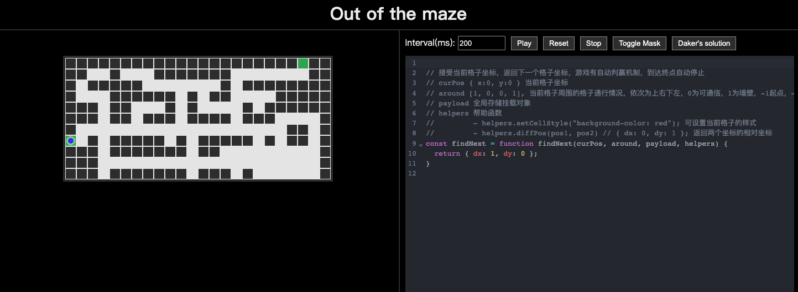

# Out-of-The-Maze

迷宫编程游戏 [out-of-the-maze](https://dakerhub.github.io/coding-game-maze/#/)



## Play game

打开链接 [out-of-the-maze](https://dakerhub.github.io/coding-game-maze/#/)，编写`findNext`函数，然后点击界面 Play 按钮开始游戏！

- 点击`Toggle Mask`查看迷宫
- 点击`Play`开始自动执行查找程序
- 点击`Reset`重置当前进度
- 点击`Stop`暂停当前动作，支持继续编辑
- 点击`Daker's solution`填充我的代码

## Development

```sh
npm install
```

### Compile and Hot-Reload for Development

```sh
npm run dev
```
